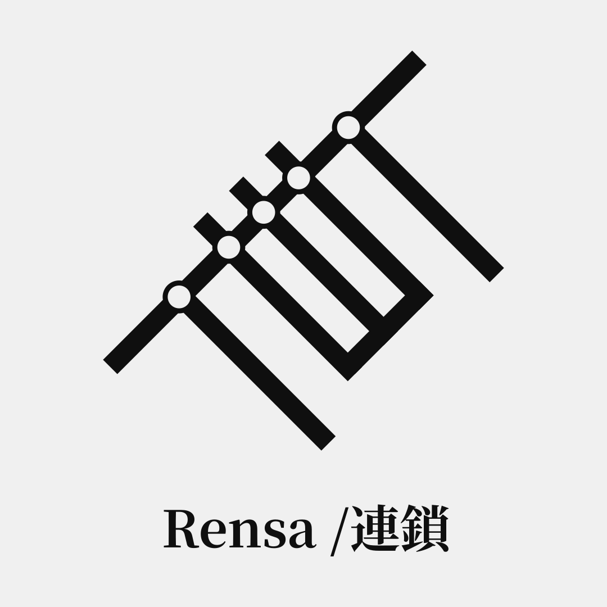

# Rensa / 連鎖 — Deterministic Project Orchestration

  <a href="/README.md">🇺🇸 <strong>English</strong></a> |
  <a href="/resources/docs/it/README.it.md">🇮🇹 <strong>Italiano</strong></a> |
  <a href="/resources/docs/ro/README.ro.md">🇷🇴 <strong>Română</strong></a> |
  <a href="/resources/docs/ja/README.ja.md">🇯🇵 <strong>日本語</strong></a> |
  <a href="/resources/docs/zh-Hans/README.zh-Hans.md">🇨🇳 <strong>中文（简体）</strong></a>

  

## ❖ Core features

| Features | Status |
|:-|:-|
| Generate projects from templates | ❌ Not yet implemented |
| Support both local templates and remotely fetched templates | ❌ Not yet implemented |
| Data compression at rest for storage efficiency | ❌ Not yet implemented |
| Declarative project definition and build system | ❌ Not yet implemented |
| Parallel execution with differential directives | ❌ Not yet implemented |
| Integrated version control system | ❌ Not yet implemented |
| Repository access secured via public-key authentication | ❌ Not yet implemented |
| Support for multiple public-key cryptography algorithms | ❌ Not yet implemented |
| Optimized for low bandwidth usage | ❌ Not yet implemented |

## ❖ Contributing
This project is currently maintained in a solo-maintenance phase and is not accepting pull requests.

The author is open to commissioned work in custom software development (CLI and GUI applications, web systems, dashboards, APIs, and backend services). Requests can be made via the author’s website.

Commissioned work helps support continued development of Rensa.

## ❖ Project Development
Requirements:  
▸ Linux  
▸ GCC 15+ (or any C++23-compliant compiler on a glibc-based Linux system)  
▸ Make  

## ❖ License
This project is licensed under the [MIT License](/LICENSE)

## ❖ Contact
For technical inquiries, contact the maintainer: https://rairen.net/contact

